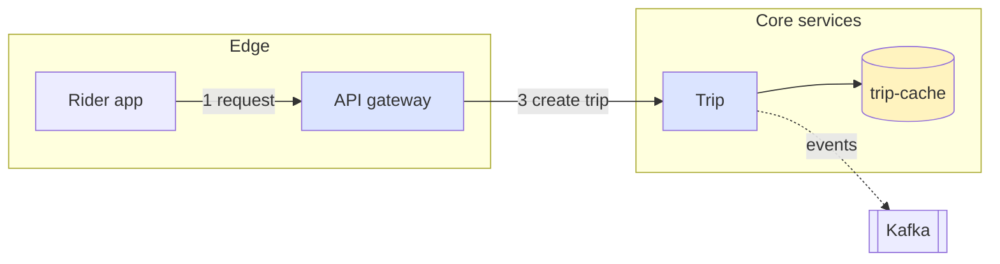

# Agent layer on Excalidraw: design review and low-level design

Date 2026-09-25. Reviewer: exc-architect session. Inputs: `dogfood-synthesis.md`,
`agent-native-diagramming.md`, `DOGFOOD-sdk-sketches.md`, CONTRACT v1.4, the 0.18.1 `.d.ts`.
Status: proposal, not implemented. Sections 1–11 leave CONTRACT v1.4 untouched; §12.5 adds `Thread.proposal` and bumps CONTRACT to v1.5 when built.

## TL;DR

1. **The spec/compiler is the value; the renderer sidecar is the enabler; lint is the oracle.**
   Build the sidecar first (one Playwright page on the existing bundle, two endpoints), then a
   ten-rule lint validated on the two fixtures, then spec → compile → apply. Lint before the
   compiler is right only because lint is the compiler's acceptance test. Do not spend more
   than a day on lint before the compiler exists.
2. **Own layout and routing in the layer; never store hand-routed points as truth.** ELK places
   and routes; arrows are plain polylines with `origin:generated`; every `apply` re-routes edges
   whose endpoints moved. This removes pains 1, 2, 4, 5 at the source instead of detecting them.
   `elbowed` is not a skeleton field in 0.18.1, so do not plan on Excalidraw's router.
3. **Ids are deterministic paths, so merge needs no reconciliation heuristic.** `ride/core/trip`
   is the element id. Base state for the three-way merge is three field-group hashes stored in
   `customData.gen`, so no shadow copy of the last output is kept anywhere.
4. **Token budget: the spec is the working format, about 20× cheaper than raw elements.**
   The agent reads the spec, `apply` replies with counts and ids, never elements, and images are
   requested only for lint hits. Estimates in §4.
5. **Diff: semantic diff over the spec plus the existing human-edit feed. No image diff.** The
   user's instinct is right for verification (side-by-side crop on request) and wrong for the
   change feed, which must carry ids and authors and already exists in `events.jsonl`.
6. **Cut from v0:** JSON components with params and ports, theming beyond roles, the query
   grammar, yctimlin compat aliases, set-of-mark overlays, code mode. Composition arrives with
   the TS builder, where functions are the component mechanism and `tsc` checks references.
7. **Missing from the plan:** text measurement inside compile, `eject` as the real escape hatch,
   rename semantics, where the spec is stored, and a two-hour token eval right after step 3.
8. **Mermaid addendum: make the agent-facing text form a Mermaid superset.** Valid Mermaid
   flowchart is valid input; our additions (pins, `labelAt`, `allow`, roles beyond `classDef`)
   live in `%%` comment directives, so the same file still renders in stock Mermaid. The JSON
   spec in §2 becomes the AST behind three front-ends (Mermaid text, JSON, TS builder). This
   gets within ~15 % of Mermaid's token cost, makes reviews and diffs plain text, and reuses
   Mermaid's parser instead of writing one. Details in §9.

---

## 1. Build order

| # | Deliverable | Why here | Size |
|---|---|---|---|
| 0 | **Renderer sidecar.** Playwright Chromium loads `app/dist/canvas.html?headless=1`; two calls: `measure(elements) → {id: renderedBox}` and `snap(bbox, scale, ids?) → png`. Fonts registered before measuring | Gates lint, look, and measured compile. Playwright and the bundle already exist; it is one file | 1 day |
| 1 | **Lint v0**, ten rules (§5), run on measured boxes; test = every listed defect in the two fixtures flagged, no false positives on the clean regions | Acceptance oracle for step 3; also useful alone on human-drawn scenes | 1 day |
| 2 | **`look`** `{ids, r, scale}` → png + rendered boxes | Trivial once 0 exists; needed to check lint hits | ½ day |
| 3 | **AST v0 + Mermaid front-end + validate + compile + apply** (§2, §3, §9). Parser = Mermaid's own, run in the sidecar. Layout = ELK layered, one graph per zone, incremental seeding from the scene | The token win and the defect removal at source | 3–4 days |
| 4 | **`diff`**: spec-vs-spec semantic diff + compact human-edit feed from events | Cheap; both inputs exist | ½ day |
| 5 | **Eval**: ride-hailing and BST tasks redone by one tester through the spec; count calls, tokens, lint hits vs the dogfood baseline | Decides whether to continue to 6 or fix 3 | ½ day |
| 6 | **TS builder** emitting the spec; functions as components | Composition and static references, once the spec is stable | 2 days |

Total to a decision point (step 5): about six working days of subagent time.

Why not the compiler first: without a lint that runs on rendered boxes there is no way to know
the compiler is better than the testers' Python grids. Why not lint for a week: pains 1, 2, 4,
5 and 7 are removed by the compiler, not found by lint; lint on an agent-authored raw scene only
confirms defects that still cost the same manual calls to fix.

## 2. Spec v0

One JSON document per diagram, stored server-side as `<session>/spec.json` next to
`events.jsonl`, and embedded verbatim in `.excalidraw` exports under `appState.customData.spec`
so a file round-trips. Validated with zod in `shared/` (strict: unknown keys rejected).

```
Diagram   { id, direction?: "right"|"down", theme?: "system-design"|"algo",
            zones: Zone[], nodes: Node[], edges: Edge[], notes: Note[], raw: Raw[] }
Zone      { id, label?, direction?, nodes: Node[] }         // one level only in v0
Node      { id, label, role?: Role, shape?: Shape, tone?: Tone,
            size?: {w,h}, pin?: Pin, allow?: Allow[] }
Edge      { id?, from: Ref, to: Ref, label?, labelAt?: 0..1,
            kind?: "sync"|"async"|"data", allow?: Allow[] }
Note      { id, text, anchor: Ref, at?: "below"|"right"|"above"|"left", gap?: number }
Raw       { anchor?: Ref, dx?, dy?, element: ExcalidrawElementSkeleton }
Pin       { x, y } | { rightOf|leftOf|above|below: Ref, gap?: number }
Allow     { rule: LintCode, why: string }
Role      "service"|"store"|"queue"|"client"|"external"|"actor"|"generic"
Ref       node id, or "zone/node" when the node lives in a zone
```

Roles map to shape, fill, stroke and default size through the theme. Tone selects one of six
palette entries. The agent never writes colours or coordinates unless it pins.

Deliberately absent in v0: components with params and ports, nested zones, per-element style
overrides beyond `shape` and `tone`, string templating. Each has a place to arrive later
(components in the TS builder, nested zones as compound ELK nodes) without changing what exists.

Algo assets (array, linked list, tree, stack frames, table, hash map) already have generators in
`shared/src/assets/`. They enter the spec as `Node.role = "asset:array"` with `params`, and
compile through the existing generator. Nothing is rewritten.

## 3. Compile and apply

### 3.1 Ids

Element id = spec path, slash-joined: `ride/core/trip`. Derived elements: `ride/core/trip#label`
(bound text), `ride/e/gateway->trip` (edge, or the explicit edge id), `ride/core#frame` (zone),
`ride/n/why-redis` (note). Ids are stable across recompiles by construction, so `apply` matches
by id and needs no reconciliation heuristic. Rename of a node is delete plus create, reported as
`renamed?` when the label and edges match; it is not detected silently.

Human-drawn elements keep Excalidraw's random ids and are aliased `h1…hN` per session in every
text view (`find`, `describe`, lint output). Aliases are never written into the scene.

Zones are frames (`frameId` on children). Frames cannot nest in 0.18.1 (#8359) and membership is
geometric (#6847), so the server re-asserts `frameId` from the id prefix on every pull. This is
the already-planned WP-P work, so it lands once and serves both.

### 3.2 Compile

```
spec ─► validate ─► layout ─► emit skeleton ─► convertToExcalidrawElements({regenerateIds:false})
                     │                              │
              ELK per zone, layered,          sidecar.measure() for text boxes
              seeded with current positions   (containers sized to rendered text)
```

- **Seeding.** Every generated node already on the canvas is passed to ELK as fixed unless
  `relayout: true`. New nodes are placed around them. Pins are hard constraints; a human drag
  becomes a soft pin (`customData.pin = "soft"`) at apply time and stays fixed until the agent
  clears it or the human drags again. The movement report (`moved: [{id, dx, dy}]`) is part of
  the `apply` reply, and `dryRun` shows it without writing.
- **Routing.** ELK orthogonal routing produces edge points; edges are emitted as non-elbowed
  arrows with explicit points and `start`/`end` bindings. Because arrow points are a generated
  field group, any apply after an endpoint moved re-routes that edge. Between applies,
  Excalidraw's binding keeps ends attached, which is the acceptable interim state.
- **Text.** Container sizes come from the sidecar's rendered measurement, not from the stored
  text width. This is the fix for pain 3. When the sidecar is down, compile falls back to a
  static advance-width table and marks the result `measured: false`.
- **Labels.** `labelAt` maps to a point on the routed polyline; the label is a separate bound
  text element positioned there. Default 0.5.

### 3.3 Apply: three-way merge without a shadow copy

Each generated element carries:

```
customData: { origin: "generated", spec: "ride", path: "core/trip", role, tone,
              gen: { geom: h1, style: h2, text: h3 }, pin?: "soft"|"hard", allow?: Allow[] }
```

`gen` holds hashes of the three field groups as last written by the compiler. Per element:

| canvas group vs `gen` | new vs `gen` | Result |
|---|---|---|
| equal | equal | no-op |
| equal | differs | write new, update `gen` |
| differs | equal | keep canvas, report `override` |
| differs | differs | keep canvas, report `conflict`; `force: true` writes new |

Elements: new id not on canvas → create unless a tombstone exists. Generated id on canvas but
absent from the spec → delete when inside `prune` scope (default: the diagram), else report.
Human deletion of a generated element → tombstone in `spec.json` (`tombstones: [id]`), never
recreated, reported on every apply until the agent removes the node from the spec.

`apply` reply (this is the whole reply; elements are never echoed):

```
{ rev, created: [ids], updated: n, kept: n, deleted: [ids],
  overrides: [{id, groups}], conflicts: [{id, groups}], tombstoned: [ids],
  moved: [{id, dx, dy}], lints: [{code, ids, hint}], measured: true }
```

### 3.4 Escape hatches, and where the spec is limiting

- `raw[]` in the spec: any skeleton element, optionally anchored to a node with an offset, so it
  follows re-layout. Origin `raw`; never regenerated, always linted.
- Human elements: never touched, always linted; suppressible via `customData.allow` set from the
  app later.
- `adopt <hId> [as path]`: turns a human element into a `raw` entry with a stable id.
- `eject <path>`: the real hatch. The element stops being generated: `origin` becomes `raw`, its
  current geometry and style are copied into `raw[]`, and edges keep binding to it. Anything the
  spec cannot express is one `eject` away from stock Excalidraw, and the rest of the diagram
  stays generated.
- Limits that remain: nested zones (v1), free-form arrows between arbitrary points (use raw),
  per-edge styling beyond `kind` (use raw or a theme entry), and custom shapes, which Excalidraw
  itself cannot do.

## 4. Token efficiency

Estimates for the dogfood ride-hailing diagram (25 nodes, 12 edges, 3 zones, 73 elements after
conversion). Element-JSON numbers use the report's 150–250 tokens per element.

| Artefact | Size | ≈ tokens |
|---|---|---|
| Raw scene as element JSON | 73 × ~200 | 12,000–18,000 |
| Same diagram as spec v0 | ~2.2 KB | 600–800 |
| Compact line view of a scene (`n12 rect "Auth" 120,80 200×60 →n13`) | 73 × ~20 | ~1,500 |
| `apply` reply, no lints | ~300 B | ~100 |
| `apply` reply with 3 lints | ~700 B | ~220 |
| `look` crop around one lint, r=150 | 512×384 | 266 |
| Full-canvas screenshot | 1568 px | 1,568 |

Defaults that follow:

- **Read:** the spec. `find`/`describe` exist for human-drawn content and return the compact line
  view, never element JSON unless `detail: full` for named ids.
- **Write:** the spec, whole or as a JSON patch (`ops: [{op:"add", path:"/nodes/-", value}]`),
  through `apply`. One call replaces the testers' 9 applies plus 8 screenshots for an insert.
- **Image:** none by default. `apply` returns lints; the agent calls `look` on lint ids only.
  A clean apply costs ~100 tokens of reply and zero image.
- **Round estimate:** first draft plus one insert plus fixes goes from roughly 30–40 k tokens of
  scene echo and screenshots in the dogfood to under 5 k. Step 5 in §1 measures this instead of
  trusting the estimate.

## 5. Checks: what goes where

```
 tsc (later)   schema (zod)      validate          compile-time        rendered lint
 wrong param   unknown field     unknown ref       node overlap        text-overflow
 missing port  text vs label     duplicate id      dangling edge       label-on-node
               enum values       zone nesting      outside-zone        arrow-through-node
               ────── tool-format errors ──────   ─── structure ───    label-collision
                                                                       crossing (info)
```

- **Schema** rejects unknown keys, so `fontSize` on an edge fails loudly instead of silently
  (pain 4). Errors are path-precise: `edges[2].to: unknown node "kafka"`.
- **Validate** is pure and runs without the sidecar. It is also the only stage a chat host with
  no renderer needs before `apply`.
- **Compile-time** checks read the layout output. ELK guarantees no node overlap inside a zone;
  the check exists for pinned nodes and cross-zone placement.
- **Rendered lint** uses the sidecar's boxes and the routed arrow points. Rules v0:
  `text-overflow`, `text-wrapped`, `label-on-node`, `label-on-label`, `label-on-border`,
  `arrow-through-node`, `node-overlap`, `dangling-endpoint`, `outside-zone`, `crossing` (info).
  Each hit carries `ids`, `bbox`, and a `hint` naming the fix (`labelAt`, `pin`, `relayout`).
- **Suppression** is `allow: [{rule, why}]` on the node or edge, compiled into
  `customData.allow`. Lint reads `customData`, so the same mechanism works for human elements
  once the app exposes it. Suppressed hits are returned under `suppressed` with the reason, not
  dropped, so a reviewer can see them. No global or wildcard suppression.

## 6. Diff

Order and shape:

1. **Semantic diff, spec vs spec.** Pure JSON; ships with step 4. Output is a short list:
   `+node core/surge "Surge pricing"`, `~node core/pricing label`, `-edge gateway->pricing`,
   `~edge gateway->surge labelAt 0.5→0.3`.
2. **Human-edit feed** from `events.jsonl`, compact: `h 14:02 moved core/kafka (+120,0)`,
   `h 14:03 deleted e/pricing->analytics`, `h 14:05 added h7 text "why is Redis here?" near
   core/redis`. This is `canvas_changes` with authors and times and short lines; the store
   already has everything but the formatting.
3. **Image diff: not built.** `look --before rev` renders the same crop at two revisions side by
   side when the agent asks. That is enough for verification and costs one image. A pixel diff
   cannot name ids or authors, which is what the pair loop needs.

On the user's question: yes, an image diff with packed metadata is overthinking for the change
feed, and a plain side-by-side crop is enough for checking. The text feed is not optional; it is
the cheapest artefact in the system and it already exists.

## 7. Overbuilding and gaps

Cut from v0:

- JSON components with `params`, `ports`, templating: a template language inside JSON. Functions
  in the TS builder do this with real types; JSON gains `use` only if a chat host needs it.
- The query grammar: `find {type?, owner?, near?, text?}` covers the dogfood; a grammar is a
  parser to maintain.
- yctimlin compat aliases, set-of-mark overlays, code mode, theming beyond `role` and `tone`.
- Short server ids for generated elements: paths are already short and meaningful.

Gaps in the converged plan:

- The sidecar was implied by "headless renderer or live tab" but not scoped. It is the first
  deliverable and the only new infrastructure.
- Text measurement inside compile, not only inside lint. Otherwise every text container is
  sized wrong first and fixed second.
- `eject` and rename semantics (§3.1, §3.4).
- Where the spec lives (server file plus embedded on export).
- The eval at step 5, before the TS builder. It is half a day and it decides the next two weeks.

## 8. Risks

| Risk | Mitigation |
|---|---|
| ELK orthogonal routes are fine at 25 nodes and ugly at 80 | Per-zone graphs cap the problem size; `crossing` stays informational; `relayout` is explicit |
| Sidecar down in a chat host | `validate` and `apply` still run; reply carries `measured: false` and lint is skipped, not faked |
| Human drags fight incremental layout | Soft pins are the rule: a dragged node never moves back without `relayout`, and `moved[]` is reported before commit under `dryRun` |
| Frame membership drift | Server re-asserts `frameId` from id prefix on every pull (WP-P) |
| Spec and scene diverge after `eject` or tombstones | Both are recorded in `spec.json`; `apply` reports them every time until the spec is updated |

## 9. Mermaid: parity, round-trip, and where "surpass" comes from

### 9.1 The reframing

Mermaid text is what models are trained on, it is the most compact diagram notation in wide
use, and Excalidraw already ships a Mermaid parser path. So the text front-end is not a new
DSL: it is **Mermaid flowchart syntax plus directives in `%%` comments**, which stock Mermaid
ignores. One file, valid in both worlds:



Mapping: `subgraph` = zone, `:::class` = role, `classDef` = theme entry (a named theme provides
the defaults so agents write no colours), node shape brackets = `shape`, `-->`/`-.->`/`==>` =
`kind`, `linkStyle` = per-edge style override (raw-ish). Our directives: `@pin`, `@labelAt`,
`@allow`, `@note <ref> "text" [below|right]`, `@raw <ref> <json>`, `@eject <ref>`.

Parsing reuses Mermaid's own parser inside the sidecar (`mermaid` is already in the tree via
`@excalidraw/mermaid-to-excalidraw`; its flowchart `db` exposes vertices, edges, subgraphs,
classes). We keep the parse and replace the conversion, which is where the lossy step lives
(cylinders dropped, subgraph titles misplaced, as the batch tester saw). Whether the package
exports its parse stage or we call `mermaid` directly is a one-hour check **[unverified]**.

Three front-ends, one AST (§2), one compiler:

```
 Mermaid+directives ─┐
 JSON (patch ops)   ─┼─► AST ─► validate ─► compile ─► apply
 TS builder         ─┘   ▲
                          └── export: canonical Mermaid+directives (round-trip, reviews, diff)
```

### 9.2 Parity matrix

| Family | How it maps | Order | Status |
|---|---|---|---|
| flowchart / graph: nodes, shapes, edge kinds, labels, `subgraph`, `direction`, `classDef`/`:::`, `linkStyle` | **Native**: AST nodes, zones, roles, kinds; ELK layered | 1 | in v0 |
| C4 (`C4Context`, containers, boundaries) | **Native** via roles `person`/`system`/`container`/`component` and zones as boundaries; C4 syntax parsed by Mermaid's C4 db | 2 | v0.1 theme |
| architecture (beta: groups, services, junctions, icons) | **Native** via zones + roles; icons out (Excalidraw has no icon font; use text glyphs or images) | 2 | v0.1 |
| state (`stateDiagram-v2`): states, start/end, composite, notes | **Native** with two extra roles (`start`, `end`) and composite = zone; ELK | 2 | v0.1 |
| class: compartments, relations with cardinality | **Family compile**: node = rectangle with three text blocks; relations = edge kinds with the 0.18.1 arrowheads (`triangle`, `diamond`, `crowfoot_*`) | 3 | v1 |
| ER: entities, attributes, crow's-foot cardinality | **Family compile**: same as class, crow's-foot arrowheads are stock in 0.18.1 | 3 | v1 |
| sequence: participants, messages, activations, loops/alt, notes | **Family layout**, no ELK: lifelines on a horizontal grid, messages ordered by time, frames for `loop`/`alt` | 3 | v1 |
| block: grid with spans | **Family layout**: simple grid; trivial but low demand | 4 | v1.x |
| mindmap | **Family layout**: ELK radial or a tree layout; nodes are plain text | 4 | v1.x |
| timeline / gantt | **Family layout** with a time axis; rows of rectangles | 5 | out until a user asks |
| pie, xy, quadrant, sankey, git graph, requirement, journey, packet, kanban | Charts, not diagrams | — | out of scope |

Order is by what algopeeps and system-design tutoring use, not by Mermaid popularity: flowchart
and C4 for architecture, state for algorithms and protocols, sequence third because call
sequences appear in every system-design session, class and ER after that.

### 9.3 Round-trip

Yes, the spec round-trips to Mermaid text, and that should be the **canonical export**, not
a side format. Canonical means: sorted, one statement per line, directives appended in a fixed
order, so two exports of the same model are byte-equal. Consequences:

- Reviews and semantic diffs are plain text diffs of canonical Mermaid. §6's semantic diff
  reduces to `git diff` on the export, plus a two-line summariser. The JSON semantic diff is
  no longer needed as a separate artefact.
- Anything Mermaid cannot express (pins, raw elements, tombstones, ejected ids) survives in
  `%%` directives, so the file is complete. Stock Mermaid renders it without the extras.
- Import of an arbitrary Mermaid file goes through the same parser; what Mermaid's own renderer
  would draw, we draw, minus icons. The lossy conversion the tester saw is gone because the
  conversion is ours.
- Human-drawn elements (origin `human`) are exported as `%% @raw` lines only when the user
  asks (`--include-human`), so a review diff is not polluted by scratch marks.

### 9.4 Differentiators versus table stakes

Measured against Mermaid, which is the bar the user named:

| Candidate | Verdict | Why |
|---|---|---|
| Hand-edits that survive re-layout | **Differentiator, the main one** | Mermaid output is dead pixels; nobody can nudge a node and keep it. Soft pins plus incremental layout is the whole reason to render into Excalidraw |
| Freeform raw elements mixed with structured ones | **Differentiator** | Mermaid has no hatch at all. Sketching beside a generated diagram is the tutoring loop |
| Comments anchored to elements, with agent replies | **Differentiator** | No diagram-as-code tool has a review loop on the rendered element. Already built (CONTRACT §12) |
| Geometry lint with fix handles (`labelAt`, `pin`, `relayout`) | **Differentiator, second tier** | Mermaid's layouts collide labels too and offer no handle. The value is the handle, not the lint |
| Themes by role | **Table stakes** | `classDef` is exactly this. Ours adds defaults per named theme so no colours are written |
| Semantic diff | **Table stakes once the text form is Mermaid** | Text diff of source. With a JSON-only spec it would have been a feature; with Mermaid it is free, and a JSON-only spec would have made it worse than Mermaid |
| Components with ports and instances | **Real but niche** | Mermaid lacks it; users hit it at 3+ repeated services. Deliver through the TS builder, later |
| One model, many views | **Real, expensive, defer** | Structurizr's strength. Needs view definitions and per-view layout state. Not before an actual second view is wanted |

Two more that were not on the list and are differentiators: **perception the agent controls**
(`look` with ids, rendered boxes; Mermaid gives an agent nothing to inspect) and **stable ids on
rendered elements**, which is what makes comments, pins and lint addressable at all.

### 9.5 Token cost against Mermaid

Same 25-element ride-hailing diagram; Mermaid bytes are the tester's measurement, the rest are
estimates at ~3.2 bytes per token for code-like text.

| Form | Bytes | ≈ tokens | vs Mermaid |
|---|---|---|---|
| Mermaid source | 911 | ~290 | 1.0× |
| Mermaid + our directives (3 pins, 2 allows, 1 labelAt) | ~1,150 | ~360 | 1.25× |
| Same with a named theme and no `classDef` lines | ~1,000 | ~320 | 1.1× |
| JSON AST (§2) | ~2,200 | ~700 | 2.4× |
| Skeleton JSON (tester) | ~8,000 | ~2,500 | 8.6× |
| Raw elements after conversion (73 × ~700 B, ~200 tokens each, basis of §4) | ~50,000 | ~15,000 | 50×+ |

How we get close: write Mermaid, not JSON. The residual over Mermaid is only the directives, and
each directive exists because it buys a hand-edit or a lint fix that Mermaid cannot express.
A theme name replaces the `classDef` block, which is the one place our text is shorter than
Mermaid's. Per-turn cost is dominated by what comes back, and `apply` returns ~100 tokens, so a
full draft-plus-two-edits round is roughly 1,000 tokens of text and no image.

### 9.6 Effect on the build order

Step 3 gains the Mermaid front-end and loses nothing: the parser is borrowed, the AST is
unchanged. The TS builder (step 6) drops in urgency, since Mermaid text is now the compact agent
surface, and its role narrows to programmatic composition and components. Semantic diff (step 4)
gets simpler. Nothing else moves.

## 10. Amendments after review (2026-09-25, agreed with the canvas session)

1. **Ids are flat, not zone paths.** Node id = the Mermaid node id, unique per diagram
   (`ride:trip`); zone membership is data (`frameId`), so moving a node between subgraphs keeps
   comments, pins, overrides and tombstones. Paths appear only under an include or instance
   alias (`core:trip`). Edge id = `from->to`, plus `%% @id` or an ordinal for parallel edges.
   Bound text stays `<id>#label`.
2. **Origin is derived from the id, not read from `customData`.** Excalidraw copies
   `customData` on paste and duplicate. An element is generated only if its id equals the id
   the compiler derives from its `customData`; otherwise it is human, the stale generated
   fields are stripped on the next pull, and `customData.copiedFrom` keeps the source id so
   `adopt` can use it.
3. **`validate` runs in plain Bun, no browser.** Check order: import Mermaid's flowchart jison
   parser directly (jison itself has no DOM dependency; the `mermaid` entry point does), then
   `mermaid.parse` with a stub `document`, then our own grammar for the accepted subset with
   parity tests against Mermaid. Unsupported syntax is rejected with a message, never silently
   accepted.
4. **Compile does not block on the sidecar.** A measurement cache keyed by
   `(fontFamily, fontSize, text, wrapWidth)` sits over a per-font advance-width table generated
   once by the sidecar. Compile uses cache, then table; rendered lint verifies and writes back.
   `measured:false` marks table-only results.
5. **`cv diff A B` works on any two versions.** AST diff, geometry deltas above a threshold for
   pins and overrides, and a lint delta ("+2 crossings, −1 label collision"). File-vs-file diffs
   compile both sides with pure layout (no scene seeding) so the result is deterministic; the
   event feed stays the live channel.
6. **Composition by reference in v0.1.** `%% @include ./core.mmd as core` namespaces ids under
   the alias and lets edges target `core:trip`. Because frames do not nest, an include whose
   file has zones renders those zones as sibling frames held together by a `groupId`; a
   zone-free include renders as one frame. Parametric components wait for the TS builder.
7. **Three front-ends, none second-class.** v0 ships Mermaid-superset text plus the published
   JSON Schema of the AST (zod 4 emits it) with typed error codes; v0.2 ships the TS builder,
   whose real win is data-driven diagrams such as the BST round.
8. **Where the spec lives.** `.mmd` on disk for the CLI path; the session store keeps the same
   `.mmd` text (tombstones and ejects as directives), not a separate JSON file. One format,
   one compiler.

## 11. Revision for maximum reuse: Mermaid SDK + Excalidraw SDK (2026-09-25)

User steer: lean on Mermaid's full capabilities, write as little as possible. Verified against
the installed `mermaid@11.17.2` under Bun (probe: `mermaid.parse` and `getDiagramFromText`).

### 11.1 What Mermaid already gives us (verified)

| Need | Mermaid 11.17 | Verdict |
|---|---|---|
| Node shapes and labels | `A@{ shape: cyl, label: "DB" }`, db reports `type: "cyl"` | **Use.** Drops our `shape` field |
| Edge ids | `B e1@--> A` then `e1@{ curve: basis }`; db reports `id: "e1"` | **Use.** Drops `%% @id` |
| Frontmatter | `---\nconfig:\n  layout: elk\n---` parsed, `config.layout` returned | **Use** for layout, theme, `themeVariables` |
| Roles and style | `classDef`, `:::`, `class`, `linkStyle`; db `getClasses()` gives `styles: ["fill:#…"]` | **Use.** Role = class name, theme = a `classDef` block we ship |
| Parser without a browser | `mermaid.parse` needs DOMPurify, so a DOM: works under Bun with **happy-dom** (already in the tree, transitively) | **Use.** No grammar of our own |
| Syntax errors | Jison error with `hash.loc` first/last line and column | **Use.** Our validate covers only directives and references |
| Diagram model | `db.getVertices()` (Map), `getEdges()`, `getSubGraphs()`, `getClasses()`; same pattern for class, state, ER, sequence dbs | **Use** behind one adapter; not a public API, pin exactly |
| Non-flowchart families | `@excalidraw/mermaid-to-excalidraw` 2.2.2 renders SVG in a browser and converts sequence, class, ER, state; keeps Mermaid ids for flowchart, uses `nanoid` for sequence | **Wrap** for those families, post-process ids |
| ELK | `layout: elk` needs `@mermaid-js/layout-elk` (not installed) and a browser render | **Do not use through Mermaid**; call `elkjs` directly (see 11.2) |

Directives that remain, because Mermaid has no syntax for them: `@pin`, `@labelAt`, `@allow`,
`@eject`, `@tombstone`, `@include`, `@note` (anchored note; Mermaid notes exist only in
sequence and state).

### 11.2 Layout: where "let Mermaid lay out" breaks, and the smaller alternative

Mermaid's pipeline is parse → layout → SVG in one call, in a browser, with its own font
metrics, and it is not incremental. Three consequences:

1. Positions can only be read by scraping the SVG (DOM ids and class names, the thing that
   breaks `mermaid-to-excalidraw` on upgrades).
2. Node sizes come from Mermaid's font, not Excalifont, so Excalidraw text re-wraps unless the
   render is forced to the same font. That is the origin of pain 3.
3. Incremental placement by "nearest placed neighbour + Mermaid's offset" fails on the common
   case: inserting a node into a chain. Mermaid shifts everything downstream; the offset trick
   drops the new node onto the next node, and then a nudge pass has to cascade the shove along
   the flow axis. Edges touching kept nodes cannot reuse Mermaid's paths either, so a router of
   our own is needed anyway. Offset + nudge + router is about 200 lines and still wrong on
   zone growth.

The smaller and correct alternative is to call **ELK directly** for the flowchart family, which
is the engine Mermaid itself selects under `layout: elk`:

```
mermaid.parse (Bun + happy-dom) ─► db ─► sizes from sidecar.measure (Excalifont, cached)
      ─► elkjs: layered, subgraphs as compound nodes, orthogonal edge routing,
                interactive mode: kept and pinned nodes carry their canvas position
                (elk.layered.layering / crossingMinimization / cycleBreaking = INTERACTIVE)
      ─► skeleton (ids from Mermaid, styles from classDef) ─► convertToExcalidrawElements
```

ELK's interactive strategies exist for exactly this: previous positions are respected, new
nodes are slotted in, the whole layer moves by the inserted width, and edges are routed against
the final positions. Zones grow because they are compound nodes. `relayout: true` drops the
interactive options. About 120 lines of glue, no router, no nudge pass, one engine. `elkjs` is a
new dependency (~1.4 MB, pure JS, runs in Bun). Sequence, class, ER and state go through the
wrapped `mermaid-to-excalidraw` in the sidecar, where incremental placement matters less
(sequence has no free positions), with a post-process that restores Mermaid ids and applies
`gen` hashes.

Consequence for compile: text sizes come from the sidecar, through the per-install measurement
cache of §10.4 keyed by `(font, size, text, width)`. Only the advance-width table is dropped.
The sidecar is called only for strings not yet in the cache, so a re-apply that moves nodes or
edits labels already measured is browser-free; a cold compile in CI runs Playwright, which the
app tests already do.

### 11.3 Wrap, not fork, `mermaid-to-excalidraw`

Wrap and post-process. Its flowchart converter is not used (ELK path above), so its flowchart
losses (cylinders, subgraph titles) are moot. For the other families the post-process is: map
`nanoid` ids back to Mermaid participant/message ids where the db has them, attach `customData`
and `gen`, apply our classDef→style mapping. Fixes that are generic go upstream. A fork would
put 30 KB of converter under our maintenance for four families we barely touch.

### 11.4 Own-code inventory

| Module | What we write | LOC | Days |
|---|---|---|---|
| `mermaid-adapter` | parse via happy-dom, db → normalised AST, directive parser, version pin, parity fixtures | 200 | 1 |
| `validate` | directive targets, `@include` resolution, references the db cannot check | 80 | ½ |
| `sidecar` | Playwright page on the app bundle: `measure`, `snap`, `renderFamily` (m2e) | 150 | 1 |
| `layout` | elkjs graph build, compound zones, interactive seeding, pins, `labelAt` on routes | 120 | 1 |
| `emit` | AST + positions → skeleton, classDef/themeVariables → Excalidraw fields, frames | 150 | 1 |
| `apply` | gen-hash merge, tombstones, eject, adopt, prune, `frameId` re-assert, reply | 250 | 1½ |
| `lint` | 10 rules on measured boxes and routed points, suppression, hints | 200 | 1 |
| `look` | crop by ids/bbox, boxes in reply | 60 | ½ |
| `diff` | AST diff, geometry deltas, lint delta, event feed formatter | 150 | 1 |
| `export` | canonical `.mmd` writer with directives | 100 | ½ |
| `cli` + `mcp` | thin adapters over one engine | 200 | 1 |
| parity suite | fixture `.mmd` → AST and skeleton snapshots, fails loudly on upgrade | 80 | ½ |
| **Total** | | **~1,750** | **~10** |

### 11.5 Deleted from the plan

Own flowchart grammar; per-family compilers; the JSON authoring front-end (the AST's JSON Schema
is still published, from zod, for tooling and typed errors); a theme system (a shipped
`classDef` block per theme name instead); `shape` and `%% @id` directives; the advance-width
table and offline compile; the Mermaid SVG-scrape path for flowchart; the offset-placement
incremental trick.

### 11.6 Build order and estimates

| # | Deliverable | Days |
|---|---|---|
| 0 | Sidecar: `measure`, `snap` | 1 |
| 1 | Mermaid adapter + validate + parity fixtures (the two dogfood scenes rewritten as `.mmd`) | 1½ |
| 2 | ELK layout + emit + apply, flowchart only | 3½ |
| 3 | Lint + look, validated on the fixtures | 1½ |
| 4 | Diff + canonical export | 1½ |
| 5 | Eval: ride-hailing and BST via `.mmd`; tokens, calls, lint hits vs dogfood | ½ |
| 6 | Sequence, class, ER, state through wrapped m2e + post-process | 1 |
| 7 | `@include`; TS builder (v0.2) | later |

### 11.7 Risks of depending on Mermaid internals

| Risk | Handling |
|---|---|
| `db.get*` and `getDiagramFromText` are not public API; field names (`type`, `text`, `classes`, `interpolate`) can change | One adapter module; `mermaid` pinned exactly (`11.17.2`, no caret); parity suite snapshots the AST for every fixture; upgrades are a deliberate task |
| DOMPurify needs a DOM in Bun | happy-dom pinned as a direct dependency of the server; parse runs behind the adapter so the shim is set once |
| m2e scrapes Mermaid's SVG for four families | Only those families depend on it; pinned together with `mermaid`; parity snapshots of the skeleton |
| Mermaid syntax growth (new shapes, edge metadata keys) arrives faster than we map it | Unknown `shape` values fall back to rectangle with a validate warning, never a hard error, so files keep rendering |
| `elkjs` size and cold start | Load once per server process; ~150 ms cold, then ms per layout at this scale |
| Two style vocabularies (CSS-ish `classDef` vs Excalidraw fields) | One mapping table (`fill`, `stroke`, `stroke-width`, `stroke-dasharray`, `color`, `font-size`); anything else ignored with a warning |

## 12. Free editing inside Excalidraw: persistence and lift (2026-09-25)

Gap raised by the user: §11 said ".mmd only", which loses sketches and hand-placed geometry in a
git clone. Resolution below, agreed with the canvas session.

### 12.1 Two files side by side (accepted)

- `ride.mmd`: meaning. Mermaid model plus directives, text-diffable, hand-editable.
- `ride.excalidraw`: presentation. Full scene as stock Excalidraw: positions, style overrides,
  freeform and human elements, anchors, comment threads. `appState.customData` records
  `{mmdHash, compiledAt, rev}`. Full elements, not a delta, so the file opens on
  excalidraw.com without our tooling; size is not a concern at this scale, and `.gitattributes`
  marks `*.excalidraw` as `-diff` since meaning is diffed in the `.mmd`.
- On open with a hash mismatch (`.mmd` edited since the last compile), compile seeded from the
  scene: matching ids reuse their geometry and overrides, the mismatch is reported in the reply,
  never silently trusted.
- The session store holds the same pair. Embedding the `.mmd` in the `.excalidraw` is rejected:
  it loses plain-text review.

### 12.2 One IR in both directions (accepted, one amendment)

Scene → lift → AST patch → printer → `.mmd`. Never scene → text directly. Amendment: the
printer is a **minimal-edit printer** for lifts (replace a label token, add or remove a
statement or directive line, keep the author's ordering and comments), and a **canonical
printer** only for `export` and for diffs. A coding agent that hand-formats `ride.mmd` must not
see it rewritten on every board edit.

### 12.3 Lift rules (accepted, three amendments)

Computed on each human save by diffing the scene against the last compile via the `gen`
hashes. Principle: **text and bindings are meaning; geometry and style are presentation;
freeform stays freeform until promoted.**

| Human edit | Result | Written to |
|---|---|---|
| Move or resize a generated element | soft pin | scene only; `export --pins` can emit `@pin` |
| Style change on a generated element | override, kept by the merge | scene; `lift --style` emits a native `style id …` line on request |
| Label edit on a generated node or edge | **auto-lift** into the AST label | `.mmd`, coalesced |
| Arrow drawn by the human, bound at both ends to generated nodes | **auto-lift** as an edge (amendment: bindings are meaning, same as text); its hand-drawn path is presentation and is re-routed on the next apply | `.mmd`, coalesced |
| Delete a generated node or edge | **auto-lift** as removal from the AST, edges cascade (amendment: no tombstone for content the user owns; a tombstone directive is used only when the element comes from an `@include` or an instance the file cannot edit) | `.mmd` |
| Shape, text or freedraw bound to nothing | freeform: stays in the scene, linted, may be anchored; `adopt` promotes it | scene |
| Human shape connected to generated nodes | ambiguous: stays freeform, a proposal to `adopt` is surfaced | scene, plus a proposal thread |

Auto-lift is symmetric with undo: an Excalidraw undo reverts the scene, the next lift reverts
the AST. Writes to `.mmd` are coalesced (the existing 1.5 s save debounce plus a quiet period
of a few seconds) so a label being typed does not churn the file. Every lift emits a feed line.

### 12.4 Agent reads and diff (accepted)

The agent reads the `.mmd` plus the compact lift feed
(`h 14:02 relabelled core:trip "Trip" → "Trips svc"`, `h 14:03 added edge trip->pg`,
`h 14:05 freeform h7 text "why is Redis here?" near core:redis`). No scene JSON.
`cv diff A B` covers both files: semantic diff from the `.mmd`, geometry and freeform summary
from the `.excalidraw`, and the lint delta.

### 12.5 Answers

1. **Auto-lift for label edits**, and by the same principle for bound arrows and deletions.
   Proposals are reserved for the ambiguous case (`adopt`) and for the agent → human direction
   (agent proposes, human accepts).
2. **Proposals are comment threads.** Reuse CONTRACT §11/§12 threads with one added field,
   `Thread.proposal?: {kind: "adopt"|"edge"|"patch", patch}`; accepting in the sidebar applies
   the patch and resolves the thread, rejecting resolves it. CONTRACT bump to v1.5 for the field.
3. **Full elements** in `ride.excalidraw`, for the reasons in 12.1. A delta format is premature.

## 13. Backend seam and IR split (2026-09-26)

Input: `docs/diagram-ir-landscape.md`. User constraint: the design must not be bound to
Excalidraw. Verdicts on its six findings and the canvas session's take.

### 13.1 Verdicts

| # | Finding | Verdict |
|---|---|---|
| 1 | Nothing to adopt wholesale; persistent positions exist elsewhere (Structurizr, Obsidian `mm-pos`, D2/TALA); the combination is what is new | **Accept.** §9.4 is restated: the differentiator is pins + incremental re-layout + auto-lift into minimal `.mmd` edits + an agent-first surface, not "positions survive" alone |
| 2 | Mermaid 12.0.0 (ELK bundled and default); m2e 2.2.2 requires `^11.12.1`; flowchart stays jison | **Accept.** v0 pins 11.17.2; the 12 upgrade is a separate task gated by the parity suite, and it may let the bundled ELK replace our direct `elkjs` dependency |
| 3 | IR split: Model (own AST), Layout (ELK-shaped), Presentation (pins, overrides, gen, freeform, anchors, tombstones); JSON Canvas export-only | **Accept.** Layout is a first-class value consumed by lint, diff and adapters. Presentation is keyed by model id only. No `ride.layout.json` until a second read-back backend exists |
| 4 | `BackendAdapter {emit, read, measure, render, serialise}` + `Capabilities`; five Excalidraw leaks become adapter duties | **Accept, one amendment.** `NeutralScene` elements carry the raw opaque meta, not a `genId`; the "generated iff id equals the id derived from meta" rule (§10.2) is core logic and must not be re-implemented per adapter |
| 5 | Copy d2oracle's op vocabulary; explicit `rename`; label edit keeps the id | **Accept.** `AstPatch = create | set | reconnect | delete | rename | move`. In Mermaid the id and label are separate tokens (`trip[Trip]`), so a label lift never touches the id; `rename` is agent- or text-initiated only and rewrites every occurrence through the printer |
| 6 | Excalidraw first; draw.io second; tldraw licence-gated; SVG and JSON Canvas emit-only | **Accept.** No second editable backend before the step-5 eval passes |

The canvas session's take is accepted in full: thin seam (one interface file plus
`Capabilities`), a **fake backend** in the test suite so neutrality is enforced by CI, and
Presentation keyed by id, never by name or position.

Ponytail note: an interface with one implementation is normally a smell. The fake backend is
the second implementation, it is ~80 lines with in-memory scenes, `nesting: "deep"`,
`bindings: "none"`, and it exercises the capability branches that Excalidraw never takes.
That is the whole justification for the seam's cost.

One thing the seam does not cover and should not: comment threads and the sidebar are app
chrome per backend. The thread model stays neutral for free because `Thread.targetIds` are
element ids, and for generated elements the element id is the model id.

### 13.2 Where the extra day lands

Step 2 of §11.6 splits into neutral **merge + lift** and the **Excalidraw adapter** (`emit`,
`read`, `measure`, `render`, `serialise`), and the fake backend joins the parity suite in
step 1. Lint in step 3 is written against `Layout` plus measured boxes from the start.

| # | Deliverable | Days |
|---|---|---|
| 0 | Sidecar: `measure`, `snap` (becomes the Excalidraw adapter's `measure`/`render`) | 1 |
| 1 | Mermaid adapter → `Model`, validate, parity fixtures, **fake backend** | 2 |
| 2 | `Layout` via elkjs, neutral **merge**, Excalidraw adapter `emit`/`read`/`serialise`, `apply` as the composition | 4 |
| 3 | Lint and look on `Layout` + measured boxes, validated on the fixtures | 1½ |
| 4 | Lift with `AstPatch`, minimal-edit and canonical printers, diff | 2 |
| 5 | Eval | ½ |
| 6 | Sequence, class, ER, state through wrapped m2e | 1 |
| | **Total to eval** | **~11** |

### 13.3 Own-code inventory, renamed

| Module | Location | Neutral? | LOC |
|---|---|---|---|
| `mermaid-adapter` (jison db → `Model`, directives, `source.spans`, version pin) | `core/` | yes | 220 |
| `validate` | `core/` | yes | 80 |
| `layout` (elkjs, compounds, interactive seeding, pins, `labelAt`) | `core/` | yes | 120 |
| `merge` (three-way by field group over `Presentation.gen`, tombstones, prune) | `core/` | yes | 150 |
| `lift` (`NeutralScene` vs `Layout`/`Presentation` → `AstPatch[]`) | `core/` | yes | 150 |
| `printers` (minimal-edit, canonical) | `core/` | yes | 150 |
| `lint` (10 rules on `Layout` + boxes, suppression, hints) | `core/` | yes | 200 |
| `diff` (AST diff, geometry deltas, lint delta, feed formatter) | `core/` | yes | 150 |
| `types` (`Model`, `Layout`, `Presentation`, `BackendAdapter`, `Capabilities`) | `core/` | yes | 150 |
| Excalidraw adapter: `emit` (skeleton, `#label`, frames, `frameId` re-assert), `read`, `serialise` | `backends/excalidraw/` | no | 300 |
| Excalidraw sidecar: `measure`, `render` | `backends/excalidraw/` | no | 150 |
| Fake backend (tests only) | `backends/fake/` | no | 80 |
| `cli` + `mcp` adapters over one engine | `adapters/` | yes | 200 |
| Parity suite (`.mmd` → `Model`, `Layout`, skeleton snapshots; fake-backend runs) | `test/` | yes | 120 |
| **Total** | | | **~2,220** |

Moved behind the adapter, relative to §11.4: skeleton emission, bound-text-as-`#label`,
non-nesting frames and `frameId` re-assertion, binding semantics, Excalifont measurement,
`customData` as the storage of `gen` and pins, `.excalidraw` serialisation. Everything else
never imports a backend.

## 14. One ELK tree as the IR, and axis families (2026-09-26)

Proposal from the user and the canvas session: merge Model and Layout into one `ElkNode` tree
with a typed `meta` bag; axis families (sequence, gantt, timeline) use the same tree with a
family layouter. Verified with `elkjs` 0.12.0 before answering.

### 14.1 Verified

| Claim | Result |
|---|---|
| elkjs preserves extra fields such as `meta` through `layout()` | **Yes under Node 24.** `layout()` mutates and returns the same object graph; `meta` survives on root, compound, leaf, edge and edge label. No side map needed |
| elkjs runs under Bun | **No, not out of the box.** `elk.bundled.js` fails (`new _Worker` undefined: the GWT worker script does not load through Bun's module loader) and a Bun `Worker` on `elk-worker.min.js` hangs. Workarounds: run layout in the sidecar page as a Web Worker (elkjs's home turf), or a Node subprocess. Decide in step 2; the sidecar is already there |
| Cross-zone edges get routed | **Only with `elk.hierarchyHandling: INCLUDE_CHILDREN` on the root.** Without it a root-level edge into a compound's child came back with no `sections`. Must be set by default |

### 14.2 A: one tree (accept, two amendments)

Accept. The tree is our own interface extending elkjs's types (`ElkNode & { meta: NodeMeta;
children?: Node[] }`, same for edges, labels, ports), so nesting is unlimited, elkjs consumes
and returns it natively, and the TS builder is plain typed construction of it. Presentation
shrinks to freeform, anchors and style overrides. Lint, diff, lift and backends consume the
tree.

Amendment 1: **one type, two phases**, and the phase is explicit. `Graph` is the tree as
compiled from text: ids, meta, sizes, no positions. `LaidGraph` is the same type after layout,
with `x`, `y`, `sections`. Text is still the source of meaning, so anything semantic must be
derivable from `Graph` alone; the semantic diff and the printers run on a `semantic(tree)`
view that masks `x`, `y`, `width`, `height`, `sections`, `layoutOptions`. Without this mask
every layout is a "change".

Amendment 2: ELK child coordinates are **relative to the parent**; Excalidraw's are absolute.
The conversion lives in the adapter with a test, and `read` reconstructs zone parentage from
`meta`, never from `frameId`, since Excalidraw flattens nesting. Hyperedges are rejected by
validate (`sources` and `targets` of length one); ports, labels and zones get derived ids
(`id@port`, `id#label`).

### 14.3 B: axis families (accept, three amendments)

Accept the same tree, a family layouter per family, family lift maps, and the placement after
the eval.

Amendment 1: **do not run ELK for axis families.** `elk.algorithm: fixed` does nothing but
copy positions and does not route, so the family layouter fills `x`, `y` and edge `sections`
directly and the tree goes straight to the adapter. The tree type is the uniformity; the ELK
call is not.

Amendment 2: **fragments are bands, not compounds.** `alt`/`loop`/`opt`/`par` span a message
range across several lifelines, and overlapping ranges cannot both contain the same lifelines
as children. So a fragment is a sibling node with a z-order below messages and
`meta.range = [firstMsg, lastMsg]`; nesting is expressed by range containment, not the tree.
This is the weakest spot the canvas session guessed, and this is the fix.

Amendment 3: **activations own the message ports.** An activation is a child node of the
lifeline; messages that fall inside its y-range attach to `FIXED_POS` ports on the activation,
not on the lifeline, so arrows end at the bar edge as in Mermaid. Self-messages are edges with
three bends emitted by the layouter.

Gantt (x = scale(start), width = scale(duration), rows within section bands, `after` as edges,
axis ticks in `meta`) and timeline (periods by order, stacked events) are accepted as
described. Family lift maps stay as proposed: sequence vertical drag past a neighbour =
reorder, sideways participant drag = reorder participants; gantt bar drag = start snapped to
the axis unit, right-edge drag = duration; timeline event dropped on a period = move. Lint
rules must be gated by `meta.family`, since overlap and crossing mean different things on an
axis (a gantt bar overlapping its band is correct).

### 14.4 Inventory and build order

Changes relative to §13:

| Module | Change |
|---|---|
| `types` | `Model` + `Layout` collapse into `Graph`/`LaidGraph` over elkjs types; `Presentation` loses pins and `gen` (now `meta`) | −40 LOC |
| `mermaid-adapter` | emits the tree directly | ±0 |
| `layout` | + `hierarchyHandling`, + Bun/worker placement decision | +30 |
| `ts-builder` | typed construction of the tree; **moves into step 2** as a half-day item since it is now the IR's constructor | +80, ½ day |
| `families/sequence` (layouter + lift map; m2e read path for v0) | new, after the eval | 150, 1½ days |
| `families/gantt` | new, after the eval; Mermaid's gantt db parses under the adapter, m2e has none | 120, 1½ days |
| `families/timeline` | new, after the eval | 80, 1 day |

Build order: steps 0–5 as in §13.2 with the TS builder folded into step 2 (+½ day, total to
eval ~11½); step 6 stays "class, ER, state via m2e"; step 7 = sequence own layouter, gantt,
timeline (~4 days); `@include` after that.

### 14.5 Risks not yet listed

- elkjs under Bun (14.1). If the sidecar hosts layout, then compile needs the sidecar always,
  which undoes the §11.2 "browser-free re-apply" promise; a Node subprocess keeps it. Pick one
  in step 2 and record it.
- Coupling the IR to elkjs's `.d.ts`: low, ELK JSON has been stable for years, but the pin is
  exact and the parity suite snapshots the tree.
- `meta` size on the wire: the tree with meta is what `apply` and diff carry internally, never
  what the agent reads; the agent-facing surface stays the `.mmd` and feed lines.
- Axis-family lift is geometry-as-meaning, the opposite of §12.3's rule for graphs. The family
  lift maps are the only place that inversion is allowed, and they must snap (axis unit,
  message order) so a two-pixel drag never becomes a semantic edit.

## 15. Incremental layout, corrected (2026-09-26)

Input: `docs/diagram-layout-families.md`, probes T1–T9 (elkjs 0.12.0, Node) and B1 (Bun).
Two of its findings contradict §11.2 and §14, and this section supersedes them where they
conflict.

### 15.1 The correction

§11.2 claimed that ELK's interactive strategies let kept and pinned nodes carry their canvas
coordinates. **Wrong.** Interactive `layered` keeps node *order* (layer assignment and in-layer
position derived from previous coordinates), then assigns fresh coordinates (T3: x=400 came
back at x=162), and the choice-constraint options are silently ignored by `elk.layout()` (T6).
So ELK cannot be the thing that makes a human drag survive.

### 15.2 Decision: ELK for order, a one-axis placer for coordinates

Of the candidates: (b) fixed compounds of one node is rejected, it still yields order, not
coordinates. (a) and (c) each carry half of the answer. The pick is their combination:

```
 no soft pins on the canvas             soft pins present (a human has moved something)
 ──────────────────────────             ─────────────────────────────────────────────────
 ELK interactive, take coordinates      ELK interactive, take ORDER only
 wholesale (best quality, small jumps)  → kept nodes keep canvas coordinates
                                        → new node: layer and rank from ELK; coordinate =
                                          the gap between its layer neighbours on the canvas
                                        → deficit? push everything downstream in that zone
                                          along the flow axis by the deficit (one axis, order
                                          preserved, reported in moved[])
                                        → zone boxes grow to fit children
 relayout: true → the left column, and soft pins are cleared
```

This is a partial reversal of §11.2's rejection of "offset plus nudge". What was wrong there
was a general 2-D nudge with a heuristic choice of neighbour and layer. With ELK supplying the
layer and rank, the placer is a 1-D push that preserves order and every untouched coordinate,
which is predictable and reportable. About 150 lines.

**Chain insert under this choice.** `A → B → C` on the canvas, human has moved C, agent adds
`Y` between `A` and `B`. ELK interactive puts `Y` in the layer between `A` and `B`. The placer
sets `Y.x` to the midpoint of the gap after `A`; the gap is smaller than `Y.width + 2·gap`, so
`B`, `C` and everything downstream in that zone move right by the deficit, order intact, and
the reply carries `moved: [{B, +140, 0}, {C, +140, 0}]`. `C` keeps its soft pin, shifted by the
same delta. With `dryRun` the agent sees the shove before committing.

### 15.3 Routing

ELK's `sections` are valid only for coordinates ELK chose. Rule:

- ELK-coordinate applies (left column above): use ELK's sections for every edge.
- Placer applies: untouched edges keep their sections; edges touching a moved or new node are
  re-routed. **v0** re-routes them as straight bound arrows and lets lint flag
  `arrow-through-node`; between applies Excalidraw's bindings keep them attached.
- **Step 7** adds `libavoid-js` as the router for those edges, for gantt dependencies, hard
  pins and drags; its incremental reroute (~5 ms, T7) fits the placer exactly. Accepted under
  LGPL-2.1 on the condition that it stays an unmodified WASM module loaded as a separate file,
  server-side only, never inlined into the single-file MCP App bundle. The obstacle-hugging seen
  in T7 gets a parity fixture and `shapeBufferDistance`/`idealNudgingDistance` tuning before it
  is trusted.

### 15.4 Other verdicts

| # | Finding | Verdict |
|---|---|---|
| 2 | Bun: `elk-api.js` plus a real Web Worker on `elk-worker.min.js` works (B1) | **Accept, in-process Bun.** My own Bun attempt hung, so B1's exact invocation becomes the one in the parity suite; the Node-subprocess option is dropped |
| 3 | Composition: a `fixed` compound with children at our x/y is placed and routed inside `layered` (T1); needs `SEPARATE_CHILDREN` under root `INCLUDE_CHILDREN` (T9) and `FIXED_POS` boundary ports for edges into it (T1, T2) | **Accept.** Added to the axis-family recipe in §14.3: an axis family nested in a flowchart zone is a `fixed` compound with `SEPARATE_CHILDREN` and boundary ports |
| 4 | `fixed` does not route (T4) | **Confirmed**, as §14.3 amendment 1 |
| 5 | Swimlane/BPMN cannot be done with ELK alone (elkjs#327); Mermaid ~11.6k lines; yFiles commercial | **Accept, defer.** "Lanes as rows" post-pass (~200 lines) is the fallback when a user asks |
| 6 | Family layouters are 900–1,100 lines, not the §14 sizing | **Accept.** Step 7 resized below |

### 15.5 Inventory and order, revised

| Module | Change |
|---|---|
| `layout` | ELK full/interactive + **placer** (1-D push, zone growth, soft-pin shift) | +150 LOC, +1 day in step 2 |
| `router` (libavoid glue, fixtures) | new, step 7 | 100 LOC |
| `families/*` + composition driver | sequence, gantt, timeline, boundary-port recipe, router glue | 900–1,100 LOC |

| # | Deliverable | Days |
|---|---|---|
| 0–1 | Sidecar; Mermaid adapter, validate, fixtures, fake backend | 3 |
| 2 | Layout (ELK + placer), merge, Excalidraw adapter, apply, TS builder | 5½ |
| 3 | Lint and look | 1½ |
| 4 | Lift, printers, diff | 2 |
| 5 | Eval | ½ |
| | **Total to eval** | **~12½** |
| 6 | Class, ER, state via m2e | 1 |
| 7 | libavoid router; sequence own layouter, gantt, timeline, composition driver | ~7 |
| 8 | `@include`; swimlanes only on demand | later |

## 16. Mermaid `getData()` as the single model source (2026-09-26)

Proposal from the canvas session: read Mermaid's unified `LayoutData` via `db.getData()` for
the eight graph families instead of per-family getters. Probed on 11.17.2 under Bun with
flowchart, class and state diagrams before answering.

### 16.1 Evidence

| Concern | Result |
|---|---|
| `@{ shape, label }` node metadata | Kept: `{id:"A", label:"DB", shape:"cyl"}` |
| `e1@-->` edge ids | Kept: `id:"e1"` |
| `:::class` and `style` lines | Kept as `cssClasses: "default svc"` and `cssStyles: ["fill:#f9f"]` |
| `classDef` style strings | **Not in `getData()`**; still one `getClasses()` call for the map. Acceptable |
| Subgraphs | `isGroup: true` node plus `parentId` on members; subgraph `direction` as `dir` |
| Edge kinds and heads | `pattern` (solid/dotted/thick), `curve`, `arrowTypeStart/End` (`arrow_point`, `extension`, `arrow_barb`, …) |
| Class compartments | Structured: `members[]` and `methods[]` with visibility, classifier, parameters, return type; not folded into `label` |
| State pseudo-states | Synthetic ids (`root_start`), shapes `stateStart`, composite as `isGroup` with `roundedWithTitle` |
| Auto edge ids | **Index-based and unstable**: `L_B_C_0`, `id_Animal_Duck_1`, `edge2`. Inserting an edge earlier renumbers later ones |
| Lazy loading | `getDiagramFromText` throws `UnknownDiagramError` unless `mermaid.parse` ran first for that family; the adapter always parses first anyway |

### 16.2 Verdicts

1. **Accept.** One converter `LayoutData → Graph` (~100 lines): `isGroup`/`parentId` → compound
   nodes; `shape` → `meta.shape`; `cssClasses` → `meta.roles` (drop `default`); `cssStyles` →
   `meta.style`; `pattern`/`curve`/`arrowType*` → `meta.kind` and `meta.heads`; class
   `members`/`methods` → `meta.compartments`. Plus `getClasses()` for the theme map. Amendment
   on ids: **never use Mermaid's auto edge ids as identity.** Use the explicit `e1@` id when
   present, else derive `from->to[#n]` in source order, as §10.1 already says. Otherwise the
   `gen` hashes and comments on edges shift whenever an edge is inserted above.
2. **Accept.** Class, ER and state leave m2e and take the ELK path with placer, pins and lift.
   Compartments are emitted by the Excalidraw adapter as one container with a multi-line label
   in v0 (three blocks separated by a rule line later). After the step-7 sequence layouter,
   **m2e is no longer needed at all**, which removes the `^11` pin and unblocks Mermaid 12.
3. **Accept.** One call to pin and snapshot instead of N getters; the parity suite snapshots
   `getData()` output per fixture.

### 16.3 Effect on inventory and order

| Change | Effect |
|---|---|
| `mermaid-adapter`: per-family getters → one `LayoutData` converter + `getClasses()` | 220 → 200 LOC |
| Step 6 "class, ER, state via m2e" → "class, ER, state via the ELK path": compartment emit, ER crow's-foot heads, state pseudo-shapes | still ~1 day, now behind the adapter |
| m2e | sequence only until step 7, then removed; Mermaid 12 upgrade unblocked after step 7 |
| Order and totals | unchanged (~12½ to eval) |

## 17. Gaps found by the plan rewrite (2026-09-26)

Corrections applied in place: the status line now records the v1.5 CONTRACT bump from §12.5;
§9.5's raw-element row now uses §4's basis (73 elements × ~700 bytes ≈ 15,000 tokens, 50×
Mermaid); §13.3's total is 2,220.

### 17.1 Family coverage and steps

`getData()` exists on seven families in 11.17.2: flowchart, class, state, ER, requirement,
mindmap, kanban. Architecture has only `getDataStructures()`.

| Family | Step | How |
|---|---|---|
| flowchart | 2 | ELK path |
| class, ER, state | 6 | ELK path via `getData()` (§16) |
| requirement | 6 | same converter; it is a flowchart with typed nodes and relation labels; +½ day |
| mindmap | 7 | `getData()` plus a split pass (children distributed left/right of the root, then ELK `mrtree` per side); +1 day, after sequence |
| kanban | 8 | grid pass (columns × cards); low demand, after `@include` |
| architecture | **out of scope** | needs its own converter over `getDataStructures()` and icons Excalidraw cannot draw; revisit if a user asks. C4 via flowchart roles covers the tutoring need |
| sequence, gantt, timeline | 7 | own layouters (§14, §15) |
| journey, gitGraph, pie, xy, sankey, quadrant, packet | out of scope | charts or niche |

### 17.2 Sequence before step 7: drop m2e now

There is no sequence rendering until the step-7 layouter, and m2e was the only consumer of the
`^11` Mermaid pin. Decision: **drop `@excalidraw/mermaid-to-excalidraw` entirely.** One fewer
dependency, and Mermaid 12 becomes an ordinary upgrade gated by the parity suite rather than
a blocked one. §11.3 and §16.3 are superseded on this point.

### 17.3 Placement of CLI + MCP and look

- **CLI + MCP (200 LOC)**: step 2b, ½ day, right after apply exists, since the eval and the
  tutor both need a surface. Thin adapters over the engine; the existing MCP server gains
  `apply`, `lint`, `look`, `diff` and keeps its v1.4 tools.
- **look (60 LOC)**: restored to the inventory under `backends/excalidraw/` next to `render`;
  delivered in step 3 as before.

### 17.4 Eval bar

Two tasks re-run through `.mmd`: the ride-hailing architecture (draft, insert Surge, move
Pricing) and the dense BST figure, by one Opus tester with the same prompts as the dogfood.

| Measure | Go |
|---|---|
| Tool calls per task | ≤ ⅓ of the dogfood's count for that task |
| Tokens per task (input + output, images counted at the §4 rates) | ≤ ⅕ of the dogfood's |
| Lint errors left unfixed at the end | 0 |
| Defects found by eye on the final PNG that lint did not flag | 0 for the ride-hailing task; ≤ 1 for the BST task |

Go: proceed to steps 6–8. No-go: one fix cycle on steps 2–4 scoped to the failing measure
(typically the reply format or a missing lint rule), re-run the eval once; a second no-go stops
the layer and keeps v1.4 as the product.

### 17.5 Acceptance per step

| Step | Accepted when |
|---|---|
| 0 sidecar | `measure` returns boxes within 1 px of a Playwright screenshot for the two fixtures; `snap` of a bbox matches its crop |
| 1 adapter, validate, fake backend | the two fixtures and five family samples snapshot to `Graph` identically on re-run; validate rejects every case in a 20-line negative fixture with line and column; the fake backend passes the same apply tests as Excalidraw |
| 2 layout, merge, adapter, apply | the ride-hailing `.mmd` compiles to a scene with 0 node overlaps; a human move survives a re-apply; chain insert reports `moved[]` and preserves order; `dryRun` writes nothing |
| 2b CLI + MCP | `cv apply` and `canvas_apply` return the §3.3 reply for the same input; pi (via the adapter) completes draft → insert → look without reading elements |
| 3 lint, look | every defect listed in the two dogfood reports is flagged, no false positives on the clean regions; `look` returns a PNG plus boxes for the flagged ids |
| 4 lift, printers, diff | label edit, bound arrow, delete and move on the canvas produce the §12.3 results; the minimal-edit printer changes only the touched lines; `cv diff` on two fixture versions lists the semantic changes and the lint delta |
| 5 eval | §17.4 |
| 6 class, ER, state, requirement | Mermaid's own samples for each family render with 0 lint errors and correct arrowheads |
| 7 sequence, gantt, timeline, mindmap, router | Mermaid's samples render; a message drag reorders; a bar drag snaps to the axis unit; libavoid reroutes in < 50 ms on the ride-hailing scene |
| 8 `@include`, kanban | an included file renders as a zone with namespaced ids; edges into it resolve |

## 18. Phasing after the user's review; product name "ELK draw" (2026-09-26)

The layer is a separate product, **ELK draw** (`elkdraw/`), an MCP server plus CLI that
opens a localhost canvas, with a tool and CLI surface compatible with yctimlin's
`mcp-excalidraw-server` (§1a of `agent-native-diagramming.md`) so both run side by side. Each
worktree gets its own URL through portless (`https://<branch>.elkdraw.localhost`), which is
also how tasks build in parallel. The build steps of §§11–17 are regrouped into phases, each
ending with the eval at its boundary and a recorded gain versus the previous phase.

| Phase | Content | Old steps | Expected gain |
|---|---|---|---|
| 0 | scaffolding: packages, IR and adapter types, tool schemas, fixtures, eval harness, portless + worktrunk, MCP/CLI shell, CI gates, AGENTS.md | — | parallel build possible |
| 1 "skeleton+" | Excalidraw-native, no Mermaid or ELK: skeleton input with strict validate, terse id-only replies, sidecar measure+snap, rendered lint, `look`, change feed + diff with lint delta, row/column/grid placement helpers | 0, 1 (lint part), 2, 3, 4 (diff part) | fewer calls and tokens than the dogfood from terse replies, lint and crops; sets the baseline |
| 1.5 collaboration | element-anchored threads, sidebar and badges, agent read/reply/resolve, `cv wait --review`, presence pointer, turn checkpoints and per-turn undo; ported from CONTRACT v1.4 §11–12 behind the seam | — | the pair loop |
| 2 | Mermaid in, ELK two-mode layout + placer, merge, apply, TS builder, CLI/MCP apply | 1, 2, 2b | ≤ ⅓ calls, ≤ ⅕ tokens (§17.4) |
| 3 | lift, minimal-edit and canonical printers, two-file persistence, semantic diff, proposals-as-threads | 4 | hand-edits survive re-layout and land in the `.mmd` |
| 4 | class, ER, state, requirement; libavoid router; sequence, gantt, timeline, mindmap; composition driver | 6, 7 | Mermaid family parity |
| 5 | `@include`, kanban, draw.io backend, Mermaid 12 upgrade | 8 | composition and backend independence proven |

Proposals-as-threads moves from Phase 1.5 to Phase 3, where lift produces the patches a
proposal carries. Beads epics for Phases 1–5 are filed from this table.

## 19. Phase 0 scaffold review against Phases 1–5 (2026-09-26)

Reviewed at `0ffbfd6`: `CONTRACTS.md` + `core/src/contracts`, `SURFACE.md` +
`adapters/mcp/src/tools.ts`, `adapters/server` (server, store), `backends/fake`,
`sidecar`, `app` (App, sync), `test/parity`, `eval` (bar, score, baseline),
`eslint.config.js`, `AGENTS.md`, `NOTES.md`, and the beads spec for Phases 1–5.
Verdict: the scaffold is sound; the contracts match §§11–18 where they exist.
Four things must be settled before Phase 1 tasks fan out, none large. Everything
else is a per-phase contracts task or a bead edit.

### 19.1 Blocking before Phase 1

| # | Adjustment | Files | Contract change? |
|---|---|---|---|
| B1 | **Add a "contracts for Phase 1" task (1.0)** and make 1.2, 1.5, 1.8 depend on it. `AGENTS.md` says contracts change only in a dedicated task, but no phase has one, so every P1 task that needs a field would stub and report. Content: (i) `LintCode` += `arrow-through-label`, `label-on-own-arrowhead` (the two gaps the fixtures found; `Allow.rule` follows); (ii) `LintHit` += `bbox: Box` (1.5's acceptance and `look` need it) and `severity: "error" \| "info"` (`crossing` is info; the §17.4 bar counts errors only); (iii) `FeedLine`: an `op` enum for P1 (`added, removed, moved, relabelled, restyled, reconnected, applied`) plus an optional `detail` object (old/new label, dx/dy) so 1.8's "three lines for R2" is expressible; (iv) `ApplyReply`: no `skipped`; 1.2's bead text is aligned to the contract instead (`kept` covers it), and P1 fills `overrides/conflicts/moved` with `[]` and `measured` truthfully. | `core/src/contracts/{lint,reply}.ts`, `core/schemas/*`, `CONTRACTS.md` | Yes (additive) |
| B2 | **`BackendAdapter.read` must be able to reach the browser.** `read(scene): NeutralScene` is sync and pure, but `TextBox.box` is defined as "where it actually drew" and `test/fixtures/README.md` states the stored geometry is not the truth (bound labels and arrow endpoints are recomputed at render). The Excalidraw backend therefore needs the sidecar inside `read`. Change the signature to `read?(scene): Promise<NeutralScene>` (the fake wraps in `Promise.resolve`). The alternative, passing a measured box map into lint alongside the scene, spreads the browser dependency into lint, diff and look; keep it behind the seam. | `core/src/contracts/backend.ts`, `backends/fake/src/index.ts` | Yes (one return type) |
| B3 | **Package graph vs. bead paths for the sidecar.** Beads 1.3 and 1.7 put the sidecar and render under `backends/excalidraw/`, but P0 built `sidecar/` as its own package and `allowedDeps` has `backends/excalidraw: [core]`, so the backend cannot import it. Keep `sidecar/` where it is (Playwright stays out of the backend package) and add the edge `backends/excalidraw → sidecar` in the three places (`package.json`, tsconfig references, `allowedDeps`). Re-point 1.3's Owns to `elkdraw/sidecar/**`. Also unify types: the sidecar's local `BBox`/`Box`-with-id become core `Box` + `Record<Id, Box>`. | `eslint.config.js`, `backends/excalidraw/{package,tsconfig}.json`, bead 1.3 | No (package graph; orchestrator) |
| B4 | **Keep heavy engines out of the app bundle.** `app` imports `@elkdraw/core` at runtime (protocol schemas), and `core/src/index.ts` re-exports everything. Once P2 adds mermaid (touches `window` at import), elkjs (`Bun.resolveSync` worker URL) and P4 adds libavoid (LGPL WASM that must never be inlined in the app bundle, §15.3), Vite will pull them into the browser build. Fix now while core is small: core's root export stays contracts + `json.ts` (zod only); engine code (`skeleton`, `apply`, `lint`, `diff`, `place`, `mermaid`, `layout`, `merge`, `lift`, `print`, `router`, `families`) is exported from a second entry `@elkdraw/core/engine` (package.json `exports`), the deep-import lint rule exempts exactly that path, and `app/**`, `adapters/mcp/**`, `adapters/cli/**` are banned from it. Alternative with the same effect: a separate `@elkdraw/engine` package; it costs ~25 bead path edits, so the subpath is the lazier choice. | `core/package.json`, `eslint.config.js`, `NOTES.md` package graph | No (packaging; orchestrator) |

A fifth item is an ownership hole rather than code: **nobody owns
`adapters/server/**` in Phase 1**, yet the real tool bodies must live there
(`adapters/mcp` is core-only by rule and cannot call a backend or the sidecar;
`mcpTools(ctx)` in `server.ts` is the injection point). Extend 1.10's Owns to
`elkdraw/adapters/server/**` and extend `ToolContext` there (backend, sidecar,
`events(since)`, `sceneAt(rev)`, a change waiter). Same for 1.5.1, 1.5.3, 1.5.5
and 3.4, which name `core/store/**`: the store is `adapters/server/src/store.ts`
and holds wire `Element`s; re-point those paths (see 19.3).

Tasks that can start today without waiting for B1–B4: 1.1, 1.4 (sync read of
stored geometry for the snapshot acceptance; switch to async when B2 lands),
1.9, 1.11, and the fixture work in 1.6.

### 19.2 Non-blocking, by open point

1. **Contract choices (P0.2).** Strip-unknown on tree objects, strict meta,
   `roles[]`, one absolute `pin {kind, at}`: all accepted. Relative pins
   (`rightOf`, `gap`) are not needed; 1.9's placement ops produce coordinates,
   and §15.2's placer reads `meta.pin.at`. `Graph` without positions is right
   for nodes: soft pins carry the coordinates ELK interactive needs (order only,
   §15.1), and the placer owns positions. It is wrong for ports: fixed compounds
   (§14.3, 4.7) need `FIXED_POS` ports with `x`/`y`, which `GraphPort` lacks;
   add optional `x`/`y` to `GraphPort` (elkjs's own optional fields) in the P2
   contracts task. `semantic()` must additionally mask `meta.gen` and
   `meta.pin`, else every re-layout is a semantic change (gen.geom differs);
   `meta.style` stays visible (it is text: classDef). `reconnect` needs no new
   id in the patch: the derived `from->to[#n]` id is recomputed by the printer
   and reported as a `renamed` feed line. `LintHit.bbox`: B1.
2. **Two extra lint rules.** Add them (B1). §5's ten were v0; the fixtures are
   the better authority. 1.5 becomes twelve rules.
3. **Store: last-writer-wins, base rev ignored.** Fine for Phase 1 (one human,
   one agent, element versions). Two consequences to write down in 1.2: the
   agent's upserts must carry `version = stored + 1` or they lose; `ifRev`
   is check-then-apply with no `await` between (the store is sync), so it is
   atomic. The real gap is in the app: on `snapshot` it replaces the scene, so
   edits made while disconnected are dropped. Cheap fix in 1.5.2 or a small
   app bead: merge the snapshot by version instead of replacing, then flush.
4. **Eval.** Reference = best-per-measure across testers is conservative; keep.
   The warm-session BST baseline makes the BST bar stricter, not looser; keep,
   and if a Phase 2 no-go is BST-only on tokens, the one fix cycle may
   re-baseline BST from a cold run and say so. **No BST defect manifest** is a
   real hole: the bar allows ≤1 missed defect on BST but nothing can be scored.
   Add a small P1 test bead (below).
5. **Status schema, sidecar stubs, `?headless`.** `ServerStatus` is exported
   from `@elkdraw/mcp`, which is enough. Stubs are 1.3's job. `?headless=1`
   silencing the sync client is worth the ten lines; give it to 1.3 as an
   allowed edit in `app/src/` (one file).

Further notes:

- **`@excalidraw/excalidraw` under Bun.** 1.4 (`read`) and 2.6 (`emit` via
  `convertToExcalidrawElements`) import the package in Bun. Its entry touches
  the DOM, and `convertToExcalidrawElements` sizes bound text with canvas
  `measureText`. 1.4 should open with a probe (happy-dom shim as for mermaid);
  if sizing is wrong, 2.6 runs the conversion inside the sidecar page instead.
  This is the "SVG scraping" class of risk from §11.7, now on the Excalidraw
  side.
- **elkjs on Node and Bun.** `Bun.resolveSync` and Bun's Web Worker in the B1
  invocation are Bun-only; 2.11 wants both runtimes, so 2.3 needs a
  `workerFactory` switch (`worker_threads` on Node).
- **mermaid and happy-dom are dev deps of `test/parity` only.** 2.1 needs them
  as runtime deps of `core`; an orchestrator `bun add` on the base before
  Phase 2, listed in `NOTES.md`.
- **`Presentation` is missing from the contracts.** §12–13 and bead 2.6 pass
  `LaidGraph + Presentation` to `emit`; `emit(graph, prev?)` has no way to
  receive merge's per-group decisions (the TODO in `backend.ts`). Define it in
  the P2 contracts task.
- **Protocol additions for 1.5.** Threads, presence and review events are new
  `ServerMessage`/`ClientMessage` variants: a P1.5 contracts task.
- **`look` output.** Bead 1.7 promises rendered boxes for the ids; the tool
  output has `marks: Record<Id, Point>` only. Add `boxes: Record<Id, Box>` in
  1.10 (tool schema, not a contract).
- **`diff` and `changes` need the scene at a rev.** The store keeps only the
  head; add `sceneAt(rev)` by replaying from the last keyframe (1.8 owns it).
- **Event log lines are wire elements**, so the change feed derives "moved
  Kafka" by diffing `sceneAt(rev-1)` against `sceneAt(rev)`. Acceptable; it
  is what §12.4 asks for.
- **Two `Box` schemas** (core and sidecar) and **`Family` includes
  `sequence/gantt/timeline`** already: good, nothing to do.

### 19.3 Bead changes for Phases 1–5

New tasks:

| Id | Title | Owns | Blocks | Lane |
|---|---|---|---|---|
| 1.0 | Contracts for Phase 1 (19.1 B1 + B2) | `core/src/contracts/**`, `core/schemas/**`, `CONTRACTS.md`, `backends/fake/src/index.ts` (async read) | 1.2, 1.5, 1.7, 1.8 | core |
| 1.13 | BST defect manifest | `test/fixtures/dogfood/bst/**` | 1.12 | test |
| 1.5.0 | Contracts for Phase 1.5: `Thread`, `ThreadMessage`, protocol messages for threads, presence, review; `FeedLine.author` names | `core/src/contracts/**` | 1.5.1, 1.5.3, 1.5.4 | core |
| 2.0 | Contracts for Phase 2: `EdgeMeta` heads/labelAt/pattern enum, `GraphPort.x/y`, `Presentation`, `emit(graph, presentation, prev?)`, `SceneLine.heads`, `semantic()` masks `gen`/`pin`, `ApplyReply.warnings`; plus the orchestrator's dep move (mermaid, happy-dom → core) | `core/src/contracts/**`, `core/package.json` | 2.1, 2.3, 2.5, 2.6, 2.8 | core |
| 3.0 | Contracts for Phase 3: `SetPatch.style`, `Thread.proposal` (v1.5), `diff` output as semantic change records | `core/src/contracts/**` | 3.1, 3.5, 3.6 | core |
| 4.0 | Contracts for Phase 4: `NodeMeta.compartments`, `meta.range`, family layouter hook | `core/src/contracts/**` | 4.1, 4.3 | core |

Changed Owns / deps:

- 1.3: Owns → `elkdraw/sidecar/**` + `elkdraw/app/src/headless.ts` (the
  `?headless` flag). Depends on B3.
- 1.7: Owns keeps `backends/excalidraw/render/**` (thin, calls the sidecar) and
  `core/look.ts`; depends on 1.0.
- 1.10: Owns += `elkdraw/adapters/server/**`; the tool bodies and the
  `ToolContext` extension live here.
- 1.8: Owns += `elkdraw/adapters/server/src/store.ts` (`sceneAt(rev)`).
- 1.2: reply text aligned to `ApplyReply` (drop `skipped`).
- 1.5: twelve rules; hits carry `bbox` and `severity`.
- 1.5.1: Owns += `elkdraw/adapters/server/**` (thread store and replay).
- 1.5.2: `CanvasApp.tsx` → `App.tsx`. Add the snapshot-merge fix (19.2 #3).
- 1.5.3: Owns += `elkdraw/adapters/server/**` (review event, `wait`).
- 1.5.5: Owns → `elkdraw/adapters/server/src/store/**` (checkpoints).
- 3.4: Owns → `elkdraw/adapters/server/src/store/**` + `elkdraw/core/persist/**`
  (hash, pair logic, pure) + `adapters/cli/open.ts`.
- 2.10: `elkdraw/schema/**` → `elkdraw/core/schemas/**` (already there).
- 2.3: acceptance adds "same layout under Node and Bun" (worker factory).
- Phase 0: relabel `phase-0` → `phase:0` so filters line up.
